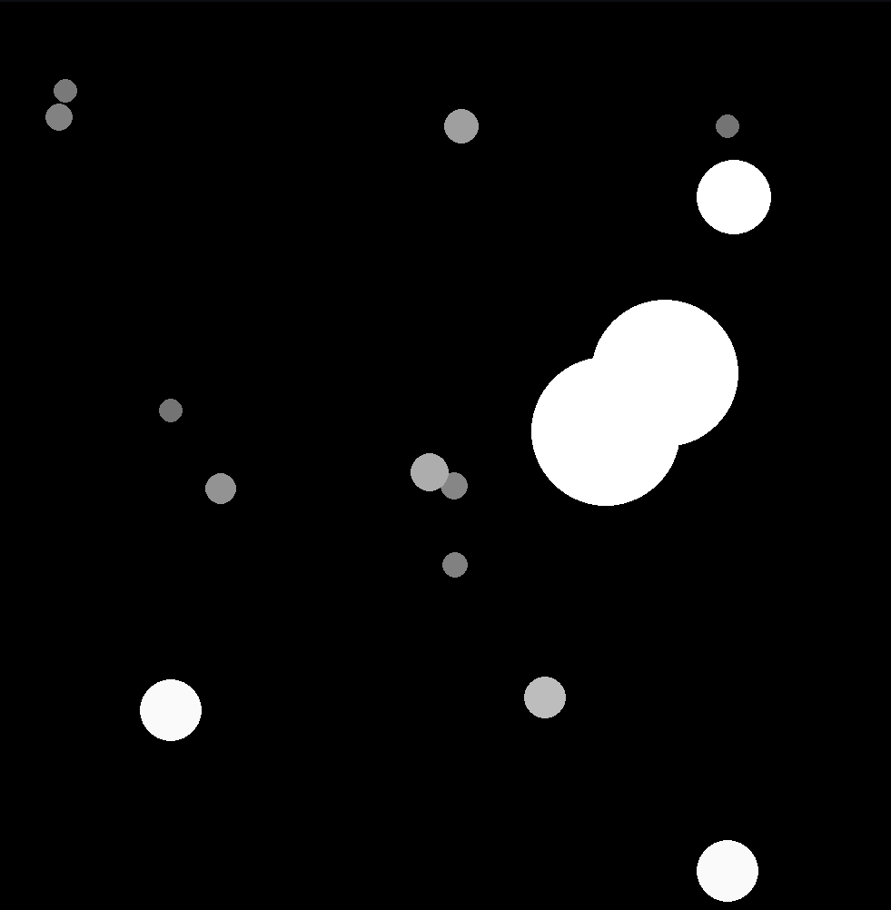

I was bored and wanted to implement the derivatives of motion in a closed system. This is that project. Have fun!


Run this command to get started:
```
git clone https://github.com/12to-the12/derivatives-of-motion.git && make
```
If you're running Windows, unfortunately this won't work for you.


